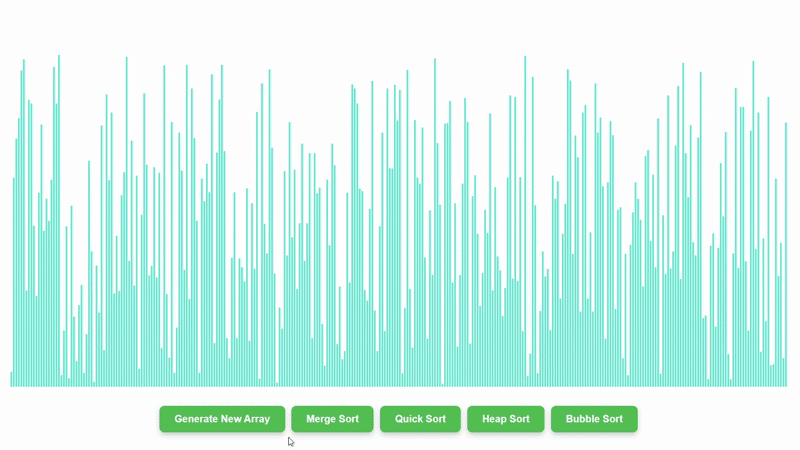

# 🧠 Sorting Algorithm Visualizer



An interactive and elegant web application to **visualize the inner workings of popular sorting algorithms**. This project is built using **React.js** and helps learners and developers alike understand how sorting algorithms transform an unsorted array step by step.

---

## ✨ Features

* 🔄 **Real-time animations** of sorting logic
* 📊 Visual representation using dynamic bars
* 🧮 Algorithms implemented:

  * Merge Sort
  * Quick Sort
  * Heap Sort
  * Bubble Sort

---

## 🧰 Tech Stack

* **React.js** – Component-based UI rendering
* **CSS** – Animation and styling
* **JavaScript** – Core sorting logic and DOM manipulations

---

## 🚀 Getting Started

### 1. Clone the Repository

```bash
git clone https://github.com/Kanif-Kumbhar/sort-vision
cd sort-vision
```

### 2. Install Dependencies

```bash
npm install
```

### 3. Start the Application

```bash
npm start
```

The app will run at `http://localhost:3000`

---

## 🎥 How It Works

* The array is displayed as a series of vertical bars, with height proportional to the value.
* Each sorting algorithm highlights comparisons (in red) and updates the bars in real-time.
* Click any sort button to watch the animation in action.
* Use “Generate New Array” to reset with a fresh unsorted set.

---

## 📁 Project Structure

```plaintext
sorting-visualizer/
├── public/
├── src/
│   ├── sortingAlgorithm/
│   │   ├── mergeSort.js
│   │   ├── quickSort.js
│   │   ├── heapSort.js
│   │   └── bubbleSort.js
│   ├── SortingVisualizer/
│   │   ├── SortingVisualizer.jsx
│   │   └── SortingVisualizer.css
│   └── App.js
├── package.json
└── README.md
```

---

## 🧠 Learning Outcomes

This project is perfect for:

* CS students learning algorithms
* Developers refreshing their DSA knowledge
* Visual learners who prefer animation over theory

---

## 🙌 Contribution

Feel free to fork this repository and contribute your own visualizations or improvements (e.g., adding new sorts, UI enhancements, settings panel).

### Ideas for Enhancement:

* Add controls to adjust array size & animation speed
* Add more sorting algorithms (e.g., Insertion Sort, Selection Sort)
* Add audio feedback for sorting steps
* Dark mode toggle

---

## 📜 License

MIT License. Free to use and modify.